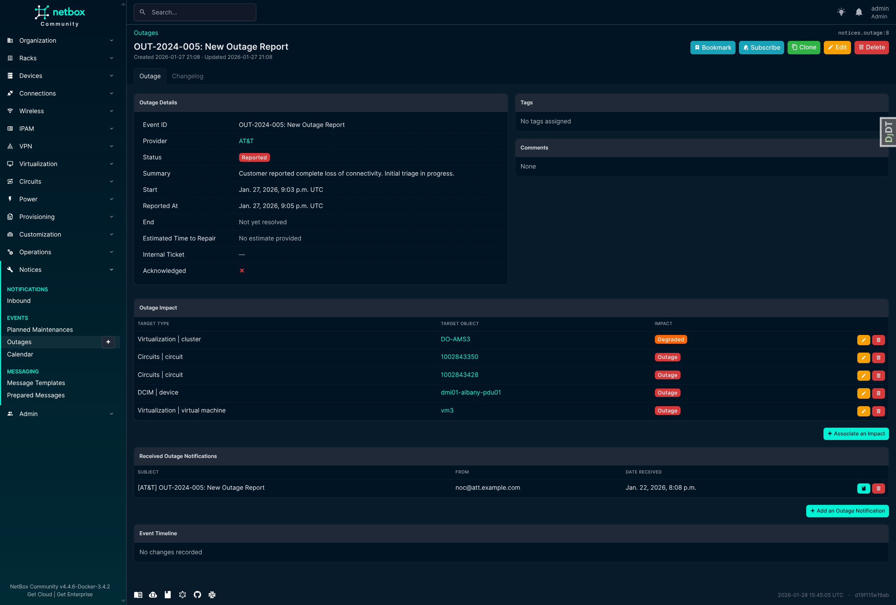

# NetBox Notices

[](https://pypi.org/project/netbox-notices/)
[](https://pypi.org/project/netbox-notices/)
[](https://github.com/jsenecal/netbox-notices/actions/workflows/ci.yml)
[](https://codecov.io/gh/jsenecal/netbox-notices)

**Repository:** [github.com/jsenecal/netbox-notices](https://github.com/jsenecal/netbox-notices)  
**Documentation:** [jsenecal.github.io/netbox-notices](https://jsenecal.github.io/netbox-notices)  
**PyPI:** [pypi.org/project/netbox-notices](https://pypi.org/project/netbox-notices)  

**Original Project:** Forked and inspired from [jasonyates/netbox-circuitmaintenance](https://github.com/jasonyates/netbox-circuitmaintenance), differs in the ability to track more than just maintenances, and circuits.

A NetBox plugin built to track maintenance and outage events across various NetBox models. This plugin is agnostic in that it is only built to store data surrounding maintenance/outage events and provide an overview of historical, active and upcoming events. The plugin tracks events at the provider level and associates impact across multiple NetBox object types (circuits, devices, virtual machines, power feeds, sites, etc.).

The plugin does not directly provide an automated approach to ingesting provider notifications, instead it extends NetBox's extensive REST API and provides GET/POST/PUT/PATCH methods to manage events. The plugin is intended to be coupled with an automated parser to handle the parsing of provider notifications and the delivery of the events to the plugin's REST API. Several example parsers are [documented here](https://jsenecal.github.io/netbox-notices/parsers/).

**Important Note:** This is a significant refactoring from the original `netbox-circuitmaintenance` plugin. **There is no upgrade path** from the original plugin. If you are using the original plugin, you will need to migrate your data manually.

## Features

- Track provider maintenance events
- Track impact from provider maintenance across multiple NetBox object types
- Configurable allowed object types (circuits, devices, virtual machines, power feeds, sites, etc.)
- Provides a consolidated view of active, upcoming and historical maintenance events at the provider and object level
- Track unplanned outage events with optional end times and ETR tracking
- Unified event notification tracking
- Quick action buttons for common maintenance operations:
  - Acknowledge maintenance events
  - Reschedule maintenance (only before start time)
  - Mark maintenance as in-progress or completed
  - Cancel maintenance with confirmation
- Event timeline with status-specific icons and colors
- Maintenance rescheduling with automatic status updates
- Interactive calendar view with FullCalendar
- iCalendar feed for external calendar integration (Google Calendar, Outlook, Apple Calendar)
- Maintenance overlap detection (coming soon)

## Compatibility

This plugin requires NetBox 4.5.0 or higher.

| NetBox Version | Plugin Version |
| -------------- | -------------- |
| 4.5.x          | 1.x            |

## Installing

A working installation of Netbox 4.5.2+ is required - [see official documentation](https://netbox.readthedocs.io/en/stable/plugins/).

### Package Installation

Activate your virtual env and install via pip:

```bash
$ source /opt/netbox/venv/bin/activate
(venv) $ pip install netbox-notices
```

To ensure the plugin is automatically re-installed during future upgrades, add the package to your `local_requirements.txt`:

```bash
# echo netbox-notices >> local_requirements.txt
```

### Enable the Plugin

In the Netbox `configuration.py` configuration file add or update the PLUGINS parameter, adding `vendor_notification`:

```python
PLUGINS = [
    'notices'
]

PLUGINS_CONFIG = {
    "notices": {},
}
```

### Configuration

The plugin supports configuration of which NetBox object types can be linked to maintenance and outage events. By default, the plugin allows linking to circuits, power feeds, and sites.

#### Default Configuration

If you don't specify any configuration, the plugin uses these defaults:

```python
PLUGINS_CONFIG = {
    "notices": {
        "allowed_content_types": [
            "circuits.Circuit",
            "dcim.PowerFeed",
            "dcim.Site",
        ]
    }
}
```

#### Custom Configuration

You can customize which object types are allowed by specifying the `allowed_content_types` setting. Content types are specified in the format `app_label.model_name`.

##### Example: Add Devices and Virtual Machines

```python
PLUGINS_CONFIG = {
    "notices": {
        "allowed_content_types": [
            "circuits.Circuit",
            "dcim.Device",
            "dcim.PowerFeed",
            "dcim.Site",
            "virtualization.VirtualMachine",
        ]
    }
}
```

##### Example: Minimal Configuration (Circuits Only)

```python
PLUGINS_CONFIG = {
    "notices": {
        "allowed_content_types": [
            "circuits.Circuit",
        ]
    }
}
```

##### Example: Extended Configuration

```python
PLUGINS_CONFIG = {
    "notices": {
        "allowed_content_types": [
            "circuits.Circuit",
            "dcim.Device",
            "dcim.Interface",
            "dcim.PowerFeed",
            "dcim.Rack",
            "dcim.Site",
            "ipam.IPAddress",
            "ipam.Prefix",
            "virtualization.VirtualMachine",
            "virtualization.VMInterface",
        ]
    }
}
```

##### How Configuration Affects Behavior

- Only object types listed in `allowed_content_types` will appear in the Impact creation forms
- The API will reject attempts to create impacts for non-allowed object types
- Changing the configuration requires a NetBox restart
- This setting controls which objects can be linked via the `Impact` model to maintenance and outage events

##### Common NetBox Object Types

| Content Type                    | Description               |
| ------------------------------- | ------------------------- |
| `circuits.Circuit`              | Network circuits          |
| `circuits.Provider`             | Service providers         |
| `dcim.Device`                   | Physical network devices  |
| `dcim.Interface`                | Device network interfaces |
| `dcim.PowerFeed`                | Power supply connections  |
| `dcim.PowerPanel`               | Power distribution panels |
| `dcim.Rack`                     | Equipment racks           |
| `dcim.Site`                     | Physical locations        |
| `ipam.IPAddress`                | IP addresses              |
| `ipam.Prefix`                   | IP prefixes/subnets       |
| `virtualization.VirtualMachine` | Virtual machines          |
| `virtualization.VMInterface`    | VM network interfaces     |

### Apply Database Migrations

Apply database migrations with Netbox `manage.py`:

```bash
(venv) $ python manage.py migrate
```

### Restart Netbox

Restart the Netbox service to apply changes:

```bash
sudo systemctl restart netbox
```

## Outage Tracking

In addition to planned maintenance, this plugin supports tracking unplanned outage events:

### Key Features

- **Optional End Time**: Outages can be created without an end time, which becomes required when marking as resolved
- **ETR Tracking**: Track Estimated Time to Repair with full revision history via NetBox's changelog
- **Outage Status Workflow**:
  - REPORTED: Initial state when outage is reported
  - INVESTIGATING: Team is investigating root cause
  - IDENTIFIED: Root cause identified, working on fix
  - MONITORING: Fix applied, monitoring for stability
  - RESOLVED: Outage fully resolved (requires end time)
- **Shared Impact Model**: Uses the same impact tracking as maintenance events (Impact model)
- **Unified View**: View both maintenance and outages together in a single interface
- **Flexible Object Support**: Link outages to any configured NetBox object type

## Calendar & iCal Integration

The plugin provides an interactive calendar view and iCal feed for integrating maintenance events with external calendar applications.

### Calendar View

Access the calendar at **Plugins → Notices → Calendar**. Features include:

- **Interactive FullCalendar**: Month, week, and day views
- **Color-coded events**: Different colors for maintenance vs outage, and by status
- **Click-to-view**: Click any event to see details and navigate to full view
- **Drag navigation**: Navigate between time periods

### iCal Feed

Subscribe to maintenance events in your preferred calendar application:

**Subscription URL:**
```
https://your-netbox/api/plugins/notices/ical/?token=YOUR_API_TOKEN
```

**Supported Calendar Apps:**
- **Google Calendar**: Settings → Add calendar → From URL
- **Outlook**: Calendar → Add calendar → Subscribe from web
- **Apple Calendar**: File → New Calendar Subscription

**Query Parameters:**
- `token`: Your NetBox API token (required)
- `provider`: Filter by provider ID
- `status`: Filter by status (e.g., `CONFIRMED`, `IN-PROCESS`)
- `days_past`: Include events from N days ago (default: 30)
- `days_future`: Include events up to N days ahead (default: 90)

**Example filtered subscription:**
```
/api/plugins/notices/ical/?token=YOUR_TOKEN&provider=1&status=CONFIRMED
```

### API Endpoints

**Maintenance Events:**

```text
GET    /api/plugins/notices/maintenance/
POST   /api/plugins/notices/maintenance/
GET    /api/plugins/notices/maintenance/{id}/
PATCH  /api/plugins/notices/maintenance/{id}/
DELETE /api/plugins/notices/maintenance/{id}/
```

**Outage Events:**

```text
GET    /api/plugins/notices/outage/
POST   /api/plugins/notices/outage/
GET    /api/plugins/notices/outage/{id}/
PATCH  /api/plugins/notices/outage/{id}/
DELETE /api/plugins/notices/outage/{id}/
```

**Impact Tracking:**

```text
GET    /api/plugins/notices/impact/
POST   /api/plugins/notices/impact/
GET    /api/plugins/notices/impact/{id}/
PATCH  /api/plugins/notices/impact/{id}/
DELETE /api/plugins/notices/impact/{id}/
```

**Event Notifications (Received):**

```text
GET    /api/plugins/notices/eventnotification/
POST   /api/plugins/notices/eventnotification/
GET    /api/plugins/notices/eventnotification/{id}/
DELETE /api/plugins/notices/eventnotification/{id}/
```

**Notification Templates:**

```text
GET    /api/plugins/notices/notification-templates/
POST   /api/plugins/notices/notification-templates/
GET    /api/plugins/notices/notification-templates/{id}/
PATCH  /api/plugins/notices/notification-templates/{id}/
DELETE /api/plugins/notices/notification-templates/{id}/
```

**Prepared Notifications:**

```text
GET    /api/plugins/notices/prepared-notifications/
POST   /api/plugins/notices/prepared-notifications/
GET    /api/plugins/notices/prepared-notifications/{id}/
PATCH  /api/plugins/notices/prepared-notifications/{id}/
DELETE /api/plugins/notices/prepared-notifications/{id}/
```

**Sent Notifications (read-only):**

```text
GET    /api/plugins/notices/sent-notifications/
GET    /api/plugins/notices/sent-notifications/{id}/
```

### Example: Creating an Outage

```json
POST /api/plugins/notices/outage/
{
    "name": "OUT-2024-001",
    "summary": "Fiber cut on Main Street",
    "provider": 1,
    "start": "2024-10-29T14:30:00Z",
    "estimated_time_to_repair": "2024-10-29T18:00:00Z",
    "status": "INVESTIGATING"
}
```

### Example: Creating Impact for a Circuit

```json
POST /api/plugins/notices/impact/
{
    "maintenance": 1,
    "content_type": "circuits.circuit",
    "object_id": 42,
    "impact": "OUTAGE"
}
```

### Example: Creating Impact for a Device

```json
POST /api/plugins/notices/impact/
{
    "outage": 1,
    "content_type": "dcim.device",
    "object_id": 123,
    "impact": "DEGRADED"
}
```

## Outgoing Notifications

The plugin supports generating and tracking outgoing notifications to customers and stakeholders about maintenance and outage events.

### Key Features

- **Notification Templates**: Define Jinja templates for different event types and scenarios
- **Template Scoping**: Scope templates to specific tenants, providers, sites, etc. (similar to Config Contexts)
- **Template Inheritance**: Base templates can be extended for customization
- **Recipient Discovery**: Automatically discover contacts based on roles and priorities
- **Approval Workflow**: Notifications go through draft → ready → approved → sent states
- **Delivery Tracking**: Track when notifications are sent, delivered, and viewed
- **iCal Support**: Generate iCal attachments for maintenance notifications

### Notification Status Workflow

1. **Draft**: Initial state, notification content can be edited
2. **Ready**: Content finalized, awaiting approval
3. **Approved**: Approved by user, ready to send
4. **Sent**: Dispatched to recipients
5. **Delivered**: Confirmed delivery
6. **Failed**: Delivery failed (can be retried)

### Navigation Structure

| Group | Menu Items |
|-------|------------|
| **Notifications** | Received, Sent |
| **Events** | Planned Maintenances, Outages, Calendar |
| **Messaging** | Notification Templates, Prepared Notifications |

## Data Models

The plugin uses several models to track maintenance, outage, and notification events:

### Maintenance

Represents a planned maintenance event from a provider. Key fields:

- `name`: Event identifier
- `summary`: Description of the maintenance
- `provider`: Foreign key to NetBox Provider
- `start`, `end`: Maintenance window times
- `status`: TENTATIVE, CONFIRMED, CANCELLED, IN-PROCESS, COMPLETED, RE-SCHEDULED, UNKNOWN
- `internal_ticket`: Your organization's tracking ticket reference
- `acknowledged`: Whether the event has been acknowledged

### Outage

Represents an unplanned outage event from a provider. Key fields:

- `name`: Event identifier
- `summary`: Description of the outage
- `provider`: Foreign key to NetBox Provider
- `start`, `end`: Outage window times (end is optional until resolved)
- `status`: REPORTED, INVESTIGATING, IDENTIFIED, MONITORING, RESOLVED
- `estimated_time_to_repair`: ETR timestamp (tracked with changelog history)
- `internal_ticket`: Your organization's tracking ticket reference
- `acknowledged`: Whether the event has been acknowledged

### Impact

Links maintenance or outage events to affected NetBox objects using Django's Generic Foreign Key pattern:

- `maintenance` or `outage`: Foreign key to the event (mutually exclusive)
- `content_type`: The type of affected object (e.g., "circuits.circuit", "dcim.device")
- `object_id`: The ID of the affected object
- `impact`: Impact level - NO-IMPACT, REDUCED-REDUNDANCY, DEGRADED, OUTAGE

The Impact model allows linking events to **any NetBox object type** configured in `allowed_content_types`.

### EventNotification

Stores raw email notifications received from providers:

- `maintenance` or `outage`: Foreign key to the associated event
- `email`: Binary email data
- `email_body`: Extracted body text
- `subject`: Email subject line
- `email_from`: Sender address
- `email_received`: Receipt timestamp

### NotificationTemplate

Jinja templates for generating outgoing notifications to customers/stakeholders:

- `name`, `slug`: Template identifier
- `event_type`: Which event types this template applies to (maintenance, outage, or none)
- `granularity`: How notifications are grouped (per-event, per-tenant, per-contact)
- `subject_template`, `body_template`: Jinja templates for email content
- `body_format`: Output format (markdown, html, plain text)
- `contact_roles`, `contact_priorities`: Recipient discovery configuration
- `is_base_template`, `extends`: Template inheritance support
- `weight`: Priority for template matching

### PreparedNotification

A rendered notification ready for delivery:

- `template`: Source NotificationTemplate
- `status`: Draft, Ready, Approved, Sent, Delivered, Failed
- `subject`, `body_text`, `body_html`: Rendered content snapshot
- `contacts`, `recipients`: Recipient list
- `approved_by`, `approved_at`: Approval tracking
- `sent_at`, `delivered_at`, `viewed_at`: Delivery tracking

### SentNotification

A read-only view of PreparedNotifications that have been sent or delivered. This is a proxy model that filters to only show notifications with status "sent" or "delivered".

## Screenshots

### Maintenance Event Detail

The maintenance detail view shows comprehensive information about a maintenance event including the event timeline, impacted objects, and received notifications.


**Key Features Shown:**
- Operations dropdown with quick actions (Acknowledge, Reschedule, Mark In-Progress, Mark Completed, Cancel)
- Maintenance details with timezone conversion display
- Generic impact tracking showing any configured NetBox object type
- Received notifications from providers
- Event timeline with color-coded status changes

### Outage Event Detail

The outage detail view tracks unplanned incidents with ETR (Estimated Time to Repair) and flexible status workflow.



**Key Features Shown:**
- Outage-specific status workflow (Reported → Investigating → Identified → Monitoring → Resolved)
- ETR tracking with changelog history
- Optional end time (required only when resolving)
- Impact and notification tracking

### Calendar View

Interactive calendar view for visualizing maintenance and outage events with iCal subscription support.


Click any event to see a quick summary modal with key details:


**Key Features Shown:**
- FullCalendar integration with month/week/day views
- Color-coded events by type (maintenance vs outage) and status
- Click-to-view event details modal with status, provider, timing, and summary
- iCal Subscribe and Download buttons for calendar integration

### Provider Events Widget

A "Maintenance & Outage Events" widget appears on Provider detail pages, showing all events from that provider.


**Key Features Shown:**
- All maintenance and outage events for the provider
- Tabbed view with event counts
- Event status, timing, and impact count
- ETR tracking for outages

### Object Event History Widget

A "Maintenance & Outage History" widget automatically appears on the detail pages of any impacted NetBox objects (circuits, devices, sites, etc.). This provides quick visibility into events affecting specific infrastructure.


**Key Features Shown:**
- Tabbed view separating maintenances and outages
- Event counts in tab badges
- Links to event details
- Status and impact level badges

## Credits

Forked from [jasonyates/netbox-circuitmaintenance](https://github.com/jasonyates/netbox-circuitmaintenance) with significant enhancements including multi-object type support and outage tracking.

Based on the NetBox plugin tutorial:

- [demo repository](https://github.com/netbox-community/netbox-plugin-demo)
- [tutorial](https://github.com/netbox-community/netbox-plugin-tutorial)

This package was created with [Cookiecutter](https://github.com/audreyr/cookiecutter) and the [`netbox-community/cookiecutter-netbox-plugin`](https://github.com/netbox-community/cookiecutter-netbox-plugin) project template.
